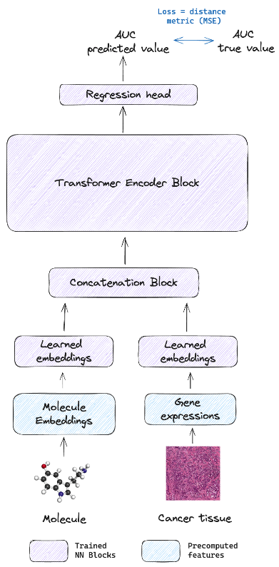

# Evaluating Drug Embeddings in Predicting Cancer Treatment Responses: A Comprehensive Analysis

## Introduction

In this work, we delve into the critical realm of Drug Response Prediction (DRP) for cancer treatment, focusing on the utilization of various embedding representations to enhance predictive accuracy and model performance.

Historically, the process of drug discovery has been marked by both labor intensity and high costs, predominantly confined to physical laboratory environments. However, the emergence of computational techniques and deep learning has brought about a significant shift in this field. In this context, our project contributes by analyzing various drug embeddings such as SMILES, SELFIES, SMILES Tokens, and Morgan fingerprints. Our aim is to determine which of these embeddings most effectively enhances predictive accuracy in cancer treatments, thereby offering a potentially valuable tool in the ongoing quest to refine and improve the drug discovery process.

Our research, documented in `report.pdf`, addresses the pressing challenge of predicting drug responses, a cornerstone in the evolution of computational drug discovery.

This project was the final assignment of course ECSE556: Deep Learning for Biology Networks at McGill University.

  

## Usage

Python3.11.5 was used to run this project. Install all required libraries using the `requirements.txt` file.

You can replicate all results from the paper by using the following scripts or notebooks:

### Data Preparation

* create a folder called `data`, put the downloaded data and generated embeddings in this folder.
* download gene expressions files: `OmicsExpressionProteinCodingGenesTPMLogp1.csv` and `Model.csv` from the [Depmap](https://depmap.org/portal/download/all/) dataset.
* download drug response AUC values for different compounds from the [CTRPv2](https://portals.broadinstitute.org/ctrp/) dataset.
* Preprocessing: execute all cells in `data_processing.ipynb`.

### Embeddings Generation

* install `docker` and `docker compose`.
* at the root dir of this project, run `docker compose up -d --build`. This will instantiate two docker containers, one contains chemBERTa and the other SELFormer.
* connect to the containers and generate the embeddings by running the notebooks `smiles_preprocessing.ipynb` and `selfies_preprocessing.ipynb` for each method respectively.
* once the embeddings have been generated, you can shut down the two containers.

### Training

* execute the script `train.py` with the desired arguments. I personally used the SLURM ressource manager on a compute cluster to train the models.

### Evaluation

* run all cell lines in `evaluation.ipynb`

Note: the models' checkpoints being non negligeably heavy, I will only provide them uppon request.
